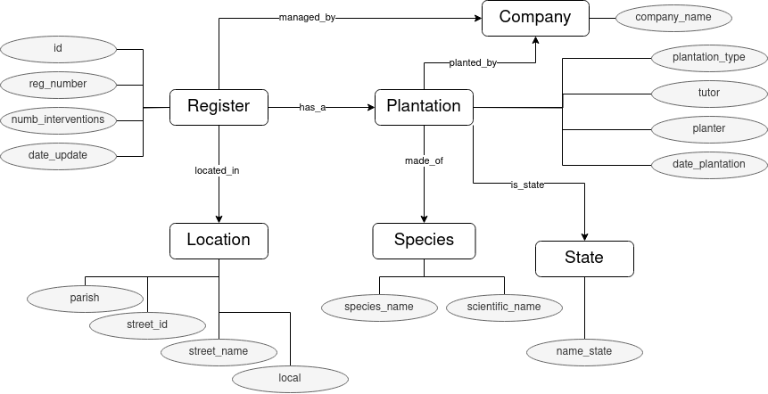

# Information
Project: TPC1 - TTL Introduction
Author: Alice Teixeira
Date: 17/02/2024

# Project Report
## Introduction
This succint report aims to describe the developed work regarding the analysis of a json file, which compiles registry entries of portuguese flora plantations, and the creation of an appropriate ontology for it, as well as creating a script for the automatic population of it, resulting in a final .ttl file.

## 1. JSON Analysis - Initial analysis
The first step was analysing the json file (namely, the file 'plantas.json' inside this directory) with the intent to detect classes, data properties and object properties.

The ontology defined can be seen ilutrated in the picture below. The correlation between the original plantas.json file and the ontology created is presented in the table beneath it. 

| plantas.json           	| Ontology: Class 	| Ontology: Object Property 	|
|------------------------	|-----------------	|---------------------------	|
| Id                     	| Register        	| id                        	|
| Número de Registo      	| Register        	| reg_number                	|
| Código de rua          	| Location        	| street_id                 	|
| Rua                    	| Location        	| street_name               	|
| Local                  	| Location        	| local                     	|
| Freguesia              	| Location        	| parish                    	|
| Espécie                	| Species         	| species_name              	|
|  Nome Científico       	| Species         	| scientific_name           	|
| Origem                 	| Company         	| company_name              	|
| Data de Plantação      	| Plantation      	| date_plantation           	|
| Estado                 	| State           	| name_state                	|
| Caldeira               	| Plantation      	| planter                   	|
| Tutor                  	| Plantation      	| tutor                     	|
| Implantação            	| Plantation      	| plantation_type           	|
| Gestor                 	| Company         	| company_name              	|
| Data de actualização   	| Register        	| date_update               	|
| Número de intervenções 	| Register        	| numb_interventions        	|

## 2. Ontology creation
From the conceptual ontology in the previous section mentioned, it was created in Protegé the appropriate entities for it, which resulted in the file 'ontology_original.owl' in this directory.

Considering the lentghy file For the population of the ontology, 

## 3. JSON Analysis - Errors and Coherence search
Regarding the consistency of the original json, there was an emerging need to evaluate the con

## 4. Automation of ontology population

## Conclusion
