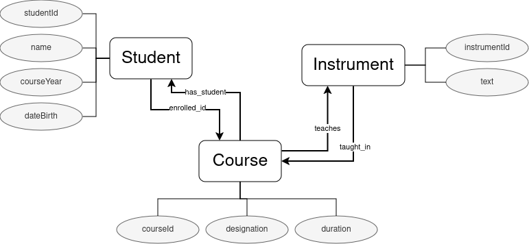

# Information
Project: TPC2 - TTL Creation  
Author: Alice Teixeira  
Date: 17/02/2024  

# Project Report
## Introduction
This succint report aims to describe the developed work regarding the analysis of a json file, which compiles registry entries of students, courses and instruments taught in a musical school, and the creation of an appropriate ontology for it, as well as creating a script for the automatic population of it, resulting in a final .ttl file.

## 1. JSON Analysis - Initial analysis
The first step was analysing the json file (namely, the file 'db.json' inside this directory) with the intent to detect classes, data properties and object properties.

Fortunately, the json file was already structured by the lists of 'alunos', 'cursos' and 'instrumentos'. The ontology defined, inspired heavily from the objects inside each list provided in the json. can be seen ilutrated in the picture below. The correlation between the original bd.json file and the ontology created is presented in the tables beneath it.

| bd.json: alunos 	| Ontology: Class 	| Ontology: Object Property 	| Ontology: Data Property 	    |
|-----------------	|-----------------	|---------------------------	|----------------------------   |
| id              	| Student         	| studentId                 	|                           	|
| nome            	| Student         	| name                      	|                           	|
| dataNasc        	| Student         	| dateBirth                 	|                         	    |
| curso           	|                 	|                           	| enrolled_in \| has_student    |
| anoCurso        	| Student         	| courseYear                	|                           	|
| instrumento     	|                 	|                           	|                         	    |

| bd.json: cursos    	| Ontology: Class 	| Ontology: Object Property 	| Ontology: Data Property 	|
|--------------------	|-----------------	|---------------------------	|-------------------------	|
| id                 	| Course          	| courseId                  	|                         	|
|   designacao       	| Course          	| designation               	|                         	|
| duracao            	| Course          	| duration                  	|                         	|
| instrumento: id    	|                 	|                           	| teaches \| taught_in    	|
| instrumento: #text 	|                 	|                           	|                         	|

| bd.json: instrumentos 	| Ontology: Class 	| Ontology: Object Property 	|
|-----------------------	|-----------------	|---------------------------	|
| id                    	| Instrument      	| instrumentId              	|
| #text                 	| Instrument      	| text                      	|

## 2. Ontology creation
From the conceptual ontology in the previous section mentioned, it was created in Protegé the appropriate entities for it, which resulted in the file 'ontology_original.owl' in this directory.

Considering the lenghty file, questions regarding the population of the ontology arose alongside doubts over the coherence of the instances we would create by populating it with the data in 'bd.json'.

## 3. JSON Analysis - Errors and Coherence search
Regarding the consistency of the original json, there was an emerging need to evaluate the data available.

A small script 'script_stat_analysis.py' was created, which partially analysed the data available. From it, it was noted an incosistency between courses and students, which could be mitigated by analysing the instrument and letters in the identifier for the course a student was enrolled in. Knowing the course data was coherent with the instrument data, making it more likely to be a true assessment of reality, it was simpy substituded in the students values of the course identifier the corresponding equivalent to the existing course.

This process led to the creation of 'db2.json', an altered version of the original db, which was coeherent with all its data.

## 4. Automation of ontology population
The creation of individuals of the ontology was automated by use of a python script, defined in the file 'script_tp2.py' in this same directory. This file iterates over each students, courses and instruments and creates indiviuals for each class defined of the ontology in steps, its order being: creation of students, creation of courses, creation of instruments.

In the end, the file 'populated_ontology.owl' is created as the final, populated, ontology.

## Conclusion
Inconsistent items in the original json file were altered in the approach taken, populating the database as close to reality as possible. The amount of different individuals compared to the original entries are minimal, making this was an approapriate resolution to the problem proposed.