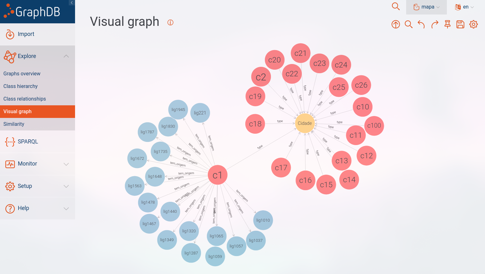
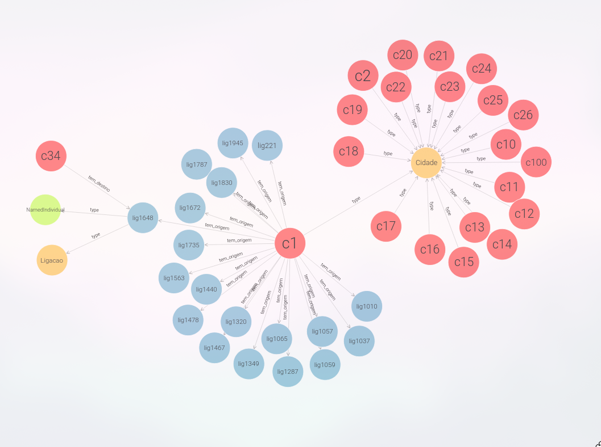

# Quais as cidades de um determinado distrito?
     Exemplifica-se com o distrito "Lisboa"

```sparql
PREFIX rdf: <http://www.w3.org/1999/02/22-rdf-syntax-ns#>
PREFIX owl: <http://www.w3.org/2002/07/owl#>
PREFIX mapa: <http://rpcw.di.uminho.pt/2024/mapa-virtual#>

SELECT * WHERE{
    ?city mapa:distrito "Lisboa"
}
```

# Distribuição de cidades por distrito?
```sparql
PREFIX rdf: <http://www.w3.org/1999/02/22-rdf-syntax-ns#>
PREFIX owl: <http://www.w3.org/2002/07/owl#>
PREFIX mapa: <http://rpcw.di.uminho.pt/2024/mapa-virtual#>

SELECT ?distrito (COUNT(?cidade) AS ?nCidades)
WHERE {
  ?cidade mapa:distrito ?distrito .
}
GROUP BY ?distrito
```

# Quantas cidades se podem atingir a partir do Porto?
```sparql
PREFIX rdf: <http://www.w3.org/1999/02/22-rdf-syntax-ns#>
PREFIX owl: <http://www.w3.org/2002/07/owl#>
PREFIX mapa: <http://rpcw.di.uminho.pt/2024/mapa-virtual#>

SELECT (COUNT(?cidade) AS ?nCidades)
WHERE {
  ?cidade mapa:distrito "Porto".
  ?cidade mapa:tem_origem ?link.
}
```

# Quais as cidades com população acima de um determinado valor?
    Exemplifica-se com o valor populacional 500000 (quinhentos mil).
```sparql
PREFIX rdf: <http://www.w3.org/1999/02/22-rdf-syntax-ns#>
PREFIX owl: <http://www.w3.org/2002/07/owl#>
PREFIX mapa: <http://rpcw.di.uminho.pt/2024/mapa-virtual#>

SELECT ?cidade
WHERE {
  ?cidade mapa:populacao ?pop .
  FILTER (xsd:integer(?pop) > 500000)
}
```


# Visual Graph

